# 机器学习中的统计学基础

## 统计学基础
> - 统计学是一门收集、整理和分析数据的方法科学
> - 其目的是探索数据内在的数量规律性、以达到对客观事物的科学认识
> - 统计学研究随机现象，以推断为特征，“由部分推及全体”的思想贯穿于统计学的始终

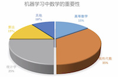

## 统计学的分类
### 描述统计学
> - 研究如何取得**反应客观现象的数据**
> - 通过**图表形式**对所收集的数据进行**加工处理和显示**
> - 通过综合概括和分析得出反应客观现象的**规律性数量特征**
### 推断统计学
> - 研究如何**根据样本数据**去推断**总体数量特征**的方法
> - 它是在对样本数据进行描述的基础上,对**统计总体的未知数量特征**做出以**概率形式**表述的**推断**

## 统计学的应用
> - 人口统计学、医药统计学、金融统计学、大数据、生物统计学、气象统计学
> - 下面看一个谷歌根据搜索量预测电影票房的大数据的例子（统计学、线性回归）

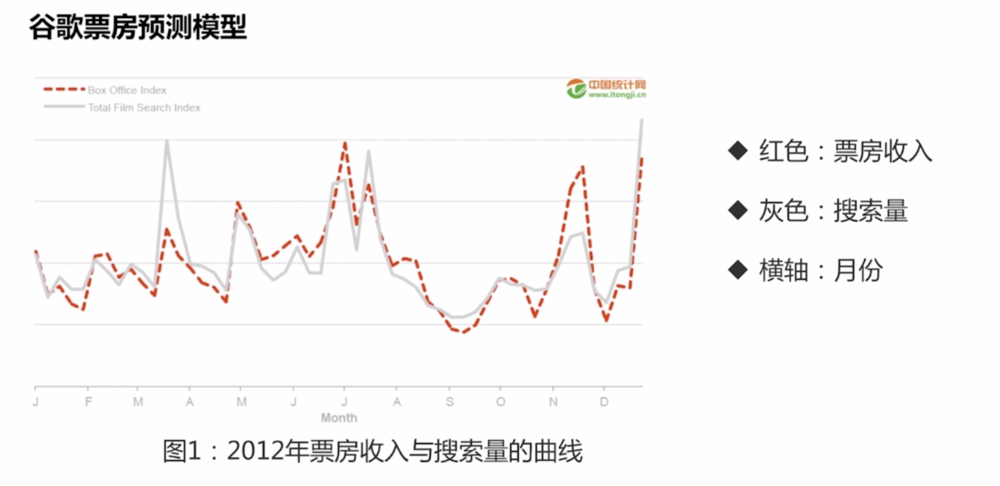
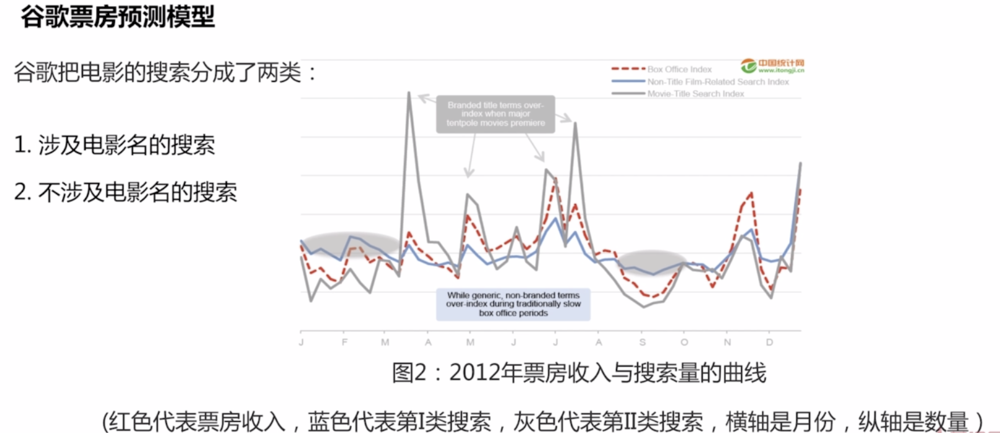
> - 大多数情况下，淡季时第一类搜索量低于第二类搜索量
> - 对于电影营销公司的策略就可以在淡季时，可以购买电影相对宽泛关键字的广告，旺季时要多购买电影名具体关键词的广告

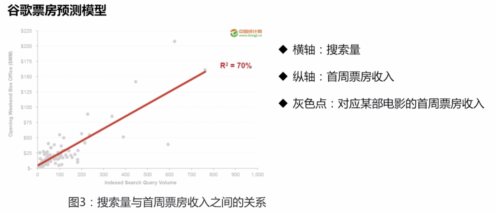
> - 发现仅仅通过搜索量来预测票房搜入也不够准确
> - 为了构建更加精确的预测模型，谷歌采用了四类指标：
> - > 1.(电影放映前一周的)电影的搜索量
> - > 2.(电影放映前一周的)电影广告的点击量
> - > 3.上映影院数量
> - > 4.同系列电影前几名的票房表现

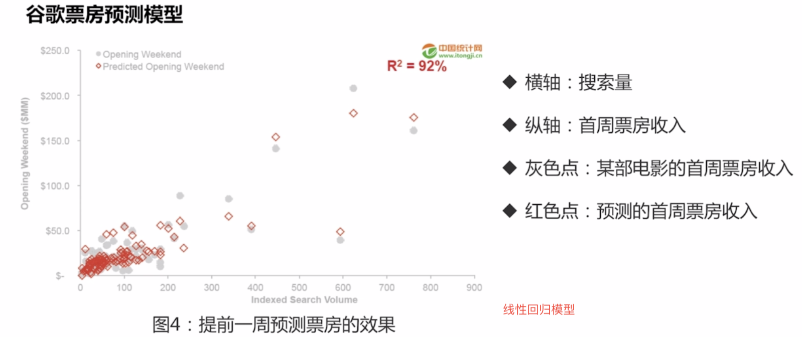
> - 问题：提前一周预测准确率为92%，但对电影营销公司价值不是很大，提前一周不够调整营销策旅来改善
> - 因此谷歌采用提前一个月预测指标：
> - > 1.指标为电影预告片的搜索量
> - > 2.同系列电影前几部的票房表现
> - > 3.档期的季节性特征
> - 每类指标又包含了多项类内指标

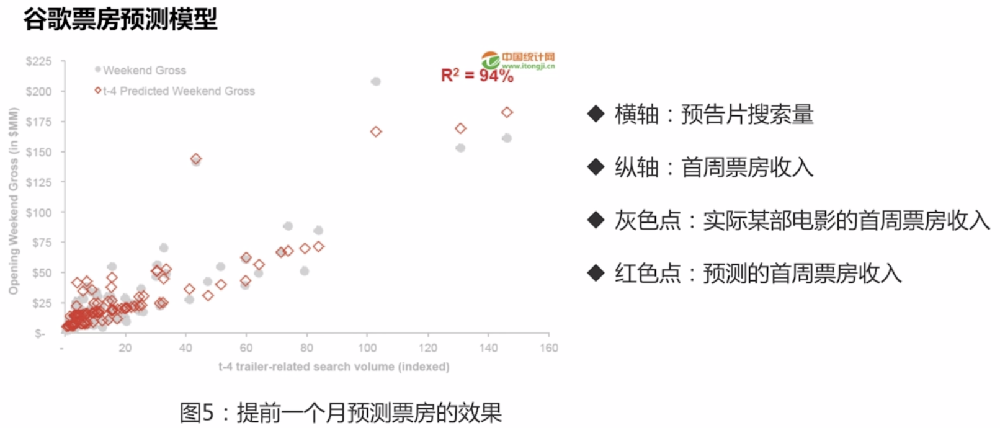
> - 谷歌大数据分析报告：去年距离上映上映一周的电影，如果比同类影片搜索量多25万，票房则高出340万，如果影片广告多于同类影片2万点击量，则票房多750万
> - 这样就为电影营销公司提供了参照数据来及时调整营销策路

## 描述统计学
### 数据描述的数值方法
> - 集中趋势：均值、中位数、众数
> - 离散程度: 极差、方差
> - 分布形状: 偏度、峰度

#### 集中趋势
> - 一组数据向其中心值靠拢的倾向和程度
> - 集中趋势测度：寻找数据的水平代表值或中心值

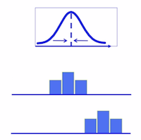
> 均值(Mean)：sum/n，它是反映数据集中趋势的一项指标

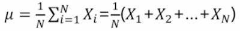
```
例：某次某考试中，A班和B版的成绩如下:
A: 70 85 68 92 98    B: 82 85 95 83 80
比较两个班的平均成绩:
meanA = 82.6    meanB = 85
```

> 中位数(Median):又称中值，对于有限数集，可以通过把所有观察值按高低排序后，找出正中间的一个数字作为中位数

```
例1：58,32,46,92,73,88,23 (奇数个)
先排序: 23,32,46,58,73,88,92
中间位置的数: 58
例2: 58,32,46,92,73,88,23,63 (偶数个)
先排序: 23,32,46,58,63,73,88,92
中间位置的数: (58+63)/2 = 60.5
```

> 众数(Mode): 一组数据中**出现次数最多**的数值，叫众数

>  - 一组数据中，可能存在多个众数，也可能不存在众数
>  - 众数不仅适用于数值型数据，也适用于非数值型数据

```
例:1 2 2 3 3 众数: 2 3
例:1 2 3 4 5 没有众数
例: 苹果 苹果 香蕉 橙 橙 橙 桃  众数: 橙  没有均值和中位数
```

均值
> - 优点：充分利用所有数据，适用性强
> - 缺点: 容易受极端值影响

中位数
> - 优点：不受极端值影响
> - 缺点: 缺乏敏感性

众数
> - 优点：当数据具有明显集中趋势时，代表性好，不受极端值影响
> - 缺点: 缺乏唯一性，可能有一个，多个或没有

案例分析
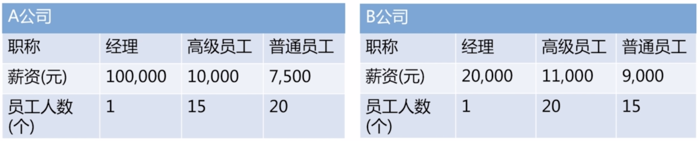
> - 比较两家公司的薪资水平
> - 若只考虑薪资，你会选择哪家公司

```
MeanA: (100000 + 15*10000 + 20*7500)/36 = 11111.1
MeanB: (20000 + 20*11000 + 15*9000)/36 = 10416.67
MedianA: 7500
MedianB: 11000
ModeA: 7500
ModeB: 11000
～ 从均值考虑：A公司的平均月薪比B公司高，但是A公司存在一个极端值，大大拉高了A的均值,这时只从均值考虑明显不太科学
～ 从中位数和众数来看: B公司的薪资水平比较高，若是一般员工，选择B公司明显更加合理
```

## 机器学习中的偏差和方差
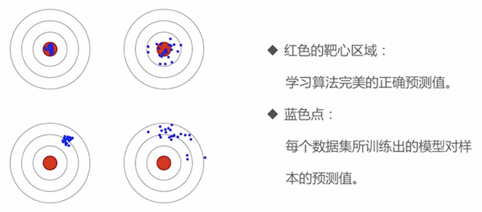
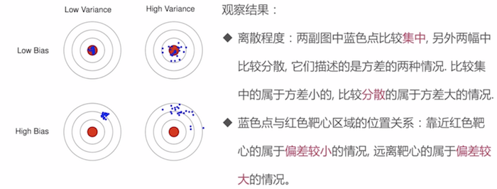

以回归任务为例，学习算法的平方预测误差期望为:

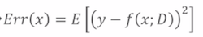
> - x:测试样本，y为真实结果
> - f(x:D): 由训练集D学得的模型f对x的预测输出

学习算法f对测试样本的期望预测为:

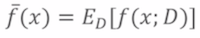
> - 期望预测也就是针对不同数据集D，f对x的预测值取其期望

使用样本数相同的不同训练集产生的方差为:

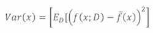
> - 方差度量了同样大小的训练集的变动所导致的学习性能的变化，即刻画了**数据扰动所造成的影响**

偏差: 期望预测与真实标记的误差成为偏差，直接取偏差的平方

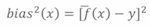
> - 偏差度量了学习算法的期望预测与真实结果的偏离程度，即刻画了**学习算法本身的拟合能力**

噪声：真实标记与数据集中的实际标记间的偏差

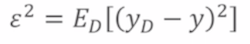
> - 噪声表达了在当前任务上任何学习算法所能达到的期望泛化误差的下界，即刻画了**学习问题本身的难度**

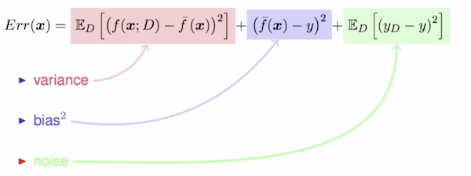
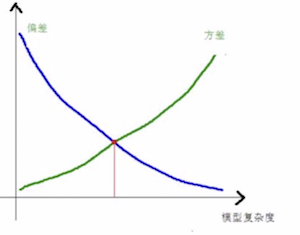
```
```

## 离散程度
```
A: 1 2 5 8 9  B: 3 4 5 6 7
MeanA = MeanB = 5
结论：描述集中趋势的统计量不够，则需要有描述数据的离散程度的统计量
```
> - 反映各变量值远离其中心值的程度
> - 常用指标: 极差和方差

### 极差
> - 最大值 - 最小值，用来描述数据的范围大小
> - A: 9-1=8  B: 7-3=4
> - A的极差比B大，所以A比B要分散

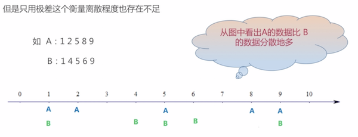

### 方差(Variance)
> - 描述一组数据离散程度的度量，用来计算每一个变量(观察值)与总体均值之间的差异
> - ((x0 - Mean)的平方 + ..... + (xn - Mean)的平方) / n
> - 方差越小，说明离散程度越低，越集中

```
A: 1 2 5 8 9  B: 3 4 5 6 7
VA = ((1-5)*(1-5)+(2-5)*(2-5)+(5-5)*(5-5)+(8-5)*(8-5)+(9-5)*(9-5)) / 5 = 10
VB = ((3-5)*(3-5)+(4-5)*(4-5)+(5-5)*(5-5)+(6-5)*(6-5)+(7-5)*(7-5)) / 5 = 2
```

## 分布形状
### 偏态(skewness)
> - 数据分布的不对称性称为偏态
> - 偏态系数：对数据分布的不对称性(即偏斜程度)的测度

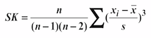
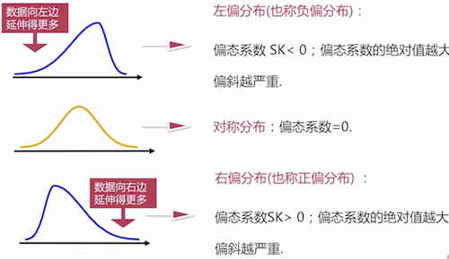

### 峰度(Kurtosis)
> - 数据分布的扁平或尖峰程度
> - 峰度系数: 数据分布峰度的度量值，对数据分布尖峰或扁平程度的测量度，一般用K表示

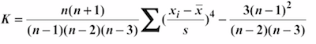
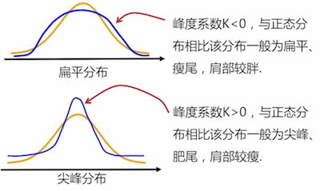


